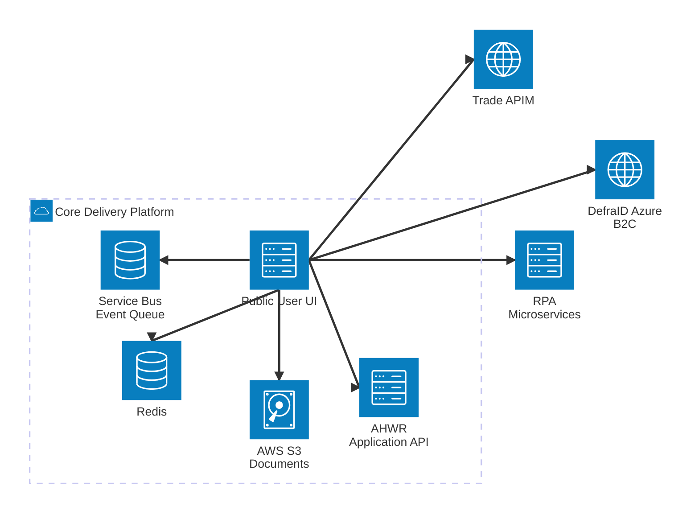

# AHWR Public User UI

## Table of contents

- [Service purpose](#service-purpose)
- [Service features](#service-features)
- [Architecture](#architecture)
- [User Authentication](#user-authentication)
- [Prerequisites](#prerequisites)
- [Running the application](#running-the-application)
  - [Environment Variables](#environment-variables)
  - [Start](#start)
  - [Running tests](#running-tests)
- [Licence](#licence)
  - [About the licence](#about-the-licence)

## Service purpose

AHWR Public User UI service, which contains the user dashboard as well as both the apply and claim user journeys.
This UI represents the public facing part of the AHWR service, and is responsible for handling user interactions,
displaying information, and facilitating the application and claim processes for farmers.

## Service features

- User dashboard: Provides an overview of the user's application and claims, allowing them to track their progress and access relevant information.
- Apply user journey: Application process for AHWR, collecting necessary information to submit their application.
- Claim user journey: Submitting claims for AHWR, ensuring users provide the required details.
- Responsive design: The UI is designed to be responsive, ensuring a seamless experience across various devices and screen sizes.
- Integration with backend services: The UI interacts with backend services to retrieve and submit data.
- Accessibility: The UI is designed with accessibility in mind, ensuring that it can be used by a wide range of users, including those with disabilities.

## Architecture



# User Authentication

The AHWR Public User UI service does not handle user authentication directly.
Instead, it relies on DefraID to manage user authentication and authorization. The user will be sent to DefraID to sign in,
and on return the authorisation is swapped out for a token that is used to retrieve the users own details.

In development environments, a dev login access point is provided that allows the use of a fixed set of details
to simulate the authentication process without needing to interact with DefraID, meaning the UI can be developed
and tested without relying on an external service.

## Prerequisites

- Docker
- Docker Compose
- [pre-commit](https://pre-commit.com/)

## Running the application

The application is designed to run in containerised environments, using Docker Compose in development and Kubernetes in production.

### Environment Variables

Make sure that you have a .env file setup before the first time you run this script, as it will copy the .env file into the image. Otherwise, delete the image and run it again. Same for any .env modification

The PUBLIC_UI_API_KEY needs to match the one the [application backend](https://github.com/DEFRA/ahwr-application-backend).

The DEFRA and APIM missing values can be retrieved from the terminal of the dev environment using:

```
aws secretsmanager get-secret-value --secret-id "cdp/services/ahwr-public-user-ui" --query SecretString --output text | jq
```

### Start

Use the start script inside the /scripts folder.

```
scripts/start
```

If you need to delete the images you can run for simplicity:

```
scripts/clean
```

You need to also spin up the [application backend](https://github.com/DEFRA/ahwr-application-backend).

### Running tests

A convenience script is provided to run automated tests in a containerised
environment. This will rebuild images before running tests via docker-compose,
using a combination of `docker-compose.yaml` and `docker-compose.test.yaml`.
The command given to `docker-compose run` may be customised by passing
arguments to the test script.

Examples:

```
# Run tests locally (moves your .env so it does not interfere)
scripts/testlocal

# Run tests in pipeline
scripts/test

# Run tests with file watch
scripts/test -w
```

## Licence

THIS INFORMATION IS LICENSED UNDER THE CONDITIONS OF THE OPEN GOVERNMENT LICENCE found at:

<http://www.nationalarchives.gov.uk/doc/open-government-licence/version/3>

The following attribution statement MUST be cited in your products and applications when using this information.

> Contains public sector information licensed under the Open Government license v3

### About the licence

The Open Government Licence (OGL) was developed by the Controller of Her Majesty's Stationery Office (HMSO) to enable information providers in the public sector to license the use and re-use of their information under a common open licence.

It is designed to encourage use and re-use of information freely and flexibly, with only a few conditions.
